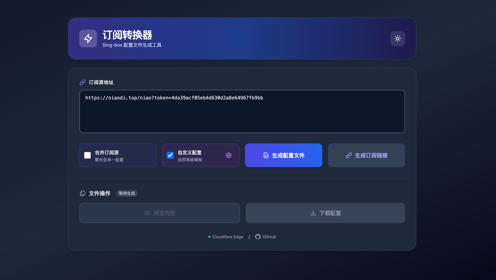
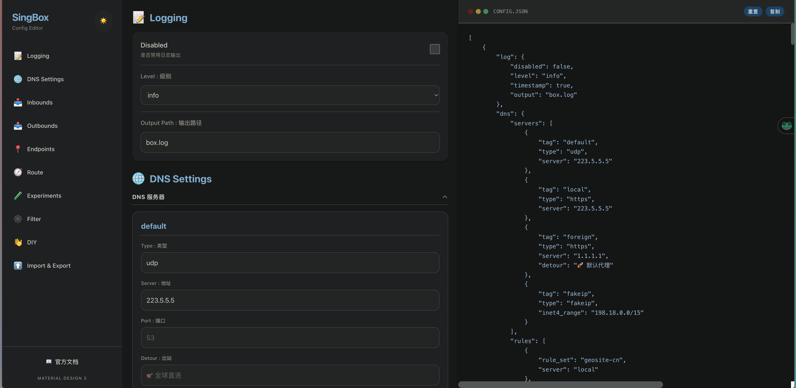

# Sing-box Config Partner 🛠️

 一个强大且灵活的 Sing-box 配置生成器与管理工具，专为 Cloudflare Workers 设计。支持最新的 Sing-box (1.11+) 语法规范，提供直观的 Web UI 进行配置调整。

## 📸 预览

| 订阅转换主页 | 高级可视化编辑器 |
| :---: | :---: |
|  |  |

## 🌟 核心特性

- **动态节点管理**:
    - **自动去重与重命名**: 支持像 clash verge 一样的 多 provider，自动为冲突节点添加后缀。
    - **智能地区分类**: 基于正向/反向正则自动将节点归类到香港、日本、美国等分组。
- **自由的配置自定义**: 支持 完全修改配置模板。
- **可视化编辑器**: 支持 DNS、Inbound、Outbound 的实时可视化配置。
- **Cloudflare 部署**: 无需服务器，直接部署在 Cloudflare Workers。

## 🚀 快速上手

### 1. 部署到 Cloudflare Workers

#### 1. 关联 GitHub 仓库
1. 登录 [Cloudflare 控制台](https://dash.cloudflare.com/)。
2. 点击左侧菜单的 **Workers 和 Pages**。
3. 点击 **创建应用程序** > **连接到 Git**。
4. 选择你的 GitHub 账号和 `sing-box-converter` 仓库。
5. 在设置页面：
    - **生产分支**：选择 `main`。
    - **构建设置**：保持默认值即可（Cloudflare 会自动识别 `wrangler.toml`）。
6. 点击 **部署站点**。

#### 2. 初始化 D1 数据库 (仅需一次)
虽然代码会自动从 Git 部署，但 D1 数据库需要手动关联和初始化：

1. **创建数据库**：
   - 在 Cloudflare 控制台导航至 **存储与数据库** > **D1**。
   - 创建一个名为 `subscribe.db` 的数据库，并**记下它的 ID**。
2. **配置 ID**：
   - 编辑项目根目录下的 `wrangler.toml` 文件，将 `database_id` 替换为你刚才获取的真实 ID。
3. **绑定到 Worker**：
   - 进入你刚创建的 Worker 管理页面。
   - 点击 **设置 (Settings)** > **变量 (Variables)**。
   - 在 **D1 数据库绑定** 区域添加绑定：
     - **变量名称**: `DB`
     - **D1 数据库**: 选择 `subscribe.db`
4. **执行 SQL 迁移**：
   - 进入 `subscribe.db` 的详情页，点击 **控制台 (Console)**。
   - 找到项目源码中的 `drizzle/migrations/` 目录，复制最新的 `.sql` 文件内容。
   - 将 SQL 内容粘贴到控制台并点击 **执行**。

## 🛠️ 技术栈

- **Core**: JavaScript (ESM)
- **Engine**: Cloudflare Workers
- **Frontend**: Vue 3, Twind (Tailwind CSS engine)
- **Mockups**: Material Design 3

## 🤝 贡献与反馈

欢迎提交 PR 或 Issue。

---
*Powered by DeepMind Advanced Agentic Coding.*
